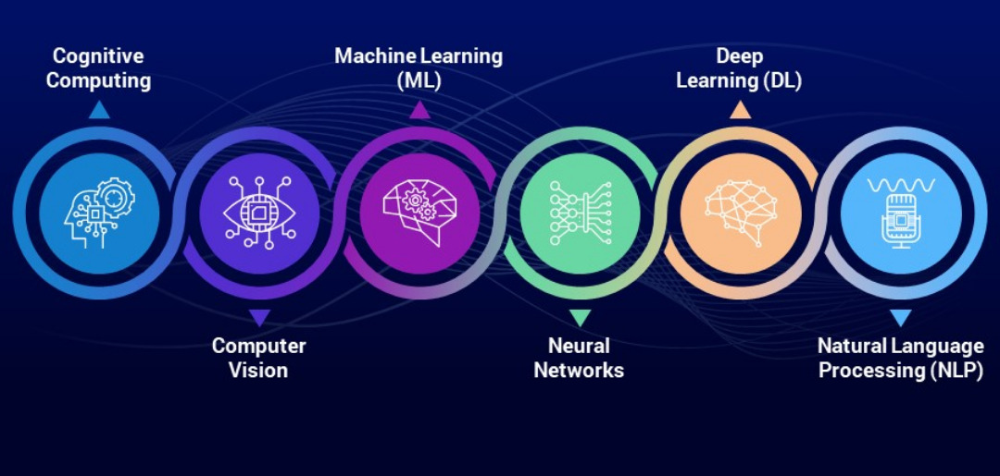
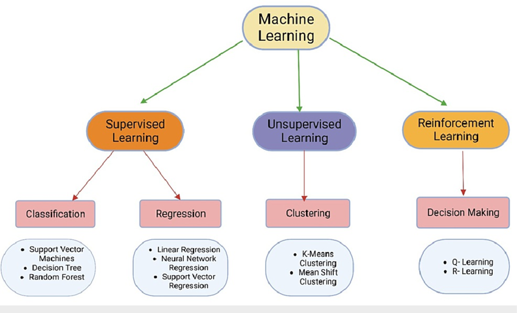

Artificial Intelligence (AI) is reshaping the way we live and work, driving advancements across industries from healthcare to finance. Whether it's voice assistants helping with daily tasks or self-driving cars navigating roads, AI plays an integral role in modern life. In this article, we’ll break down AI’s fundamental concepts, problem-solving methods, and real-world applications in an easy-to-understand way.

## Introduction

AI is essentially about creating machines that can simulate human intelligence. These systems can analyze data, recognize patterns, and make decisions, often improving over time without needing explicit programming. The ultimate goal of AI is to develop machines that can reason, learn, and act independently.

## Core Concepts of AI

### 1. Machine Learning (ML)

Machine Learning is a branch of AI that allows computers to learn from experience. Instead of being programmed with specific instructions, ML models analyze data, identify patterns, and make predictions. This is widely used in recommendation systems, fraud detection, and speech recognition.

### 2. Neural Networks

Inspired by the structure of the human brain, neural networks consist of layers of interconnected nodes (neurons) that process information. These networks help with image recognition, voice assistants, and self-driving cars by recognizing complex patterns in data.

### 3. Deep Learning

A specialized form of ML, deep learning utilizes neural networks with multiple layers to process large and complex datasets. This approach powers technologies like natural language processing, facial recognition, and medical diagnostics.

### 4. Natural Language Processing (NLP)

NLP enables computers to understand, interpret, and generate human language. Applications like virtual assistants, language translation tools, and AI chatbots rely on NLP to communicate effectively with users.

### 4. Cognitive Computing

Cognitive Computing aims to create systems that mimic human thought processes, including perception, reasoning, and learning. These systems utilize AI technologies like natural language processing and machine learning to process information in a manner similar to human cognition.

### 5. Computer Vision

Computer Vision is a field of AI that enables machines to interpret and process visual information from the world, such as images and videos. It involves techniques for acquiring, processing, and analyzing visual data to enable machines to understand and make decisions based on visual inputs.

## AI Algorithms

AI operates through various algorithms that help machines learn and make decisions. These are broadly categorized into supervised learning, unsupervised learning, and reinforcement learning.

### 1. Supervised Learning Algorithms

These algorithms learn from labeled data, meaning they have examples to learn from before making predictions. Examples include:

- **Linear Regression**: Predicts continuous values (e.g., house prices based on location and size).
- **Decision Trees**: A step-by-step decision-making process.
- **Support Vector Machines (SVM)**: Helps classify data by finding the best dividing boundary.
- **Random Forests**: A combination of multiple decision trees to improve accuracy.

### 2. Unsupervised Learning Algorithms

These models work without labeled data and instead find hidden patterns. Examples include:

- **K-Means Clustering**: Groups data into clusters based on similarities.
- **Hierarchical Clustering**: Creates a tree of related data clusters.
- **Principal Component Analysis (PCA)**: Reduces the complexity of large datasets while retaining essential information.

### 3. Reinforcement Learning Algorithms

These algorithms learn by trial and error, improving their actions based on rewards. Examples include:

- **Q-Learning**: Finds the best action to take in different situations.
- **Deep Q-Networks (DQN)**: Combines deep learning with Q-learning for complex tasks like playing video games.
- **Policy Gradient Methods**: Adjusts strategies based on accumulated rewards.

## Methods of Solving Problems Using AI

AI employs various techniques to tackle challenges across domains. Here are some commonly used approaches:

### 1. Search Algorithms

- **Breadth-First Search (BFS)**: Explores all possible solutions level by level.
- **Depth-First Search (DFS)**: Explores each path deeply before backtracking.
- **A* Algorithm**: Uses heuristics to find the shortest path efficiently.
- **AO* Algorithm**: Used in problem-solving where an optimal solution must be derived using an AND-OR graph structure, making it effective for game theory and automated planning.

### 2. Optimization Techniques

- **Genetic Algorithms**: Inspired by evolution, these find the best possible solutions.
- **Simulated Annealing**: Mimics natural cooling to optimize results.
- **Gradient Descent**: Helps AI models adjust to reduce errors.

### 3. Probabilistic Methods

- **Bayesian Networks**: Uses probabilities to make decisions under uncertainty.
- **Markov Decision Processes (MDPs)**: Models decision-making when outcomes are partly random and partly controlled.

### 4. Logical Reasoning

- **Rule-Based Systems**: Uses predefined rules to make logical decisions.
- **Fuzzy Logic**: Handles uncertainty by allowing partial truths.
- **Expert Systems**: Mimics human expertise to solve specific problems.

### 5. Neural Network-Based Approaches

- **Convolutional Neural Networks (CNNs)**: Excels in image recognition tasks.
- **Recurrent Neural Networks (RNNs)**: Processes sequential data like time-series predictions.
- **Transformer Models**: Power advanced language models like ChatGPT and Google’s BERT.

## Real-World Applications of AI

AI is transforming various industries, including:

- **Healthcare**: AI assists in medical diagnosis, personalized treatments, and drug discovery.
- **Finance**: Detects fraudulent transactions and automates trading decisions.
- **Transportation**: Self-driving cars and route optimization use AI to improve efficiency.
- **Entertainment**: AI recommends music, movies, and video games based on user preferences.

## Conclusion

AI is revolutionizing the world with its ability to automate tasks, analyze data, and make intelligent decisions. However, as AI continues to evolve, it is crucial to ensure its ethical and responsible use. By understanding AI’s core concepts and problem-solving approaches, we can harness its potential for a better future.
